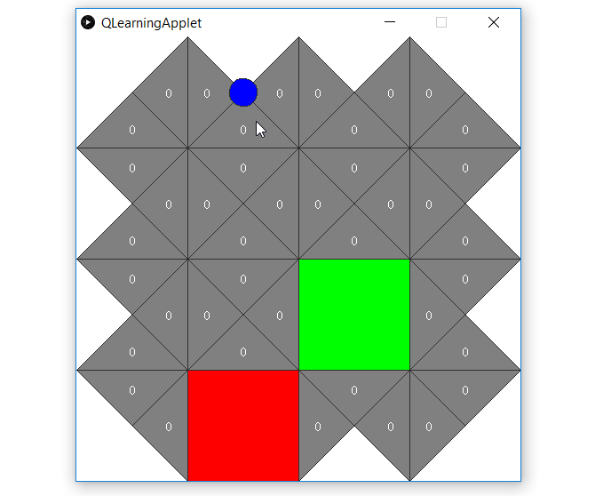

# Gridworld with Q-Learning algorithm



##To Run
```
  gradlew run
```
###Commands

```
Arrow keys: Move to new state and updates the QMatrix
q: Print Q Matrix to console
r: Print R Matrix to console
Spacebar: Switch between grid and QMatrix
Enter: Switch between learning and greedy reward following
MouseClick: Switch the current state
```
