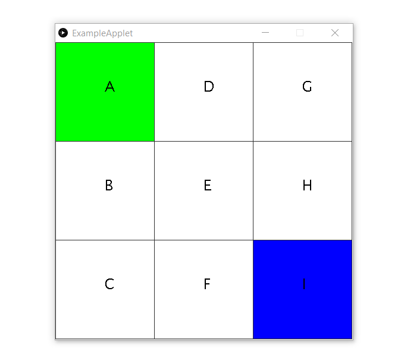

# QLearning
Q-Learning in kotlin

##To Run
```
  gradlew run (Starts QLearningApplet.kt)
```
###Commands

q: Print Q Matrix to console
r: Print R Matrix to console
Spacebar: Pause/Unpause
Enter: Switch between learning and greedy reward following
MouseClick: Switch the current state when paused


